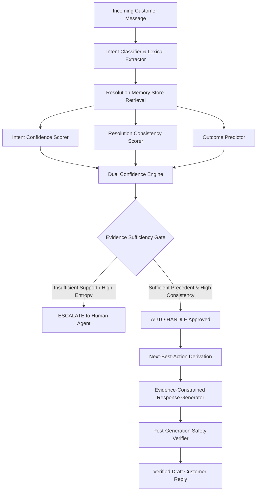

# ResolveDNA 🧬
### Evidence-First Customer Support Decision Intelligence
> *"Learning how a brand actually resolves customers, not how an LLM thinks it should."*

---

## 📌 Overview

**ResolveDNA** is an evidence-first customer support decision intelligence system built on **76,799 complete customer interaction trajectories** from `@AmazonHelp`.

Unlike generic RAG chatbots that feed raw conversation snippets into an LLM and hope for plausible replies, ResolveDNA treats customer support as an **evidence-based decision problem**. It extracts historical brand resolution trajectories, derives operational brand actions, strictly separates **Intent Confidence** from **Resolution Confidence**, and enforces an **Evidence Sufficiency Gate** to decide whether an issue can be safely auto-handled or must be escalated to a human agent.

---

## 💡 Why ResolveDNA is Different from Generic RAG

| Traditional RAG Support Chatbots | ResolveDNA (Evidence-First Intelligence) |
| :--- | :--- |
| **Uncalibrated Generation:** Generates text for every prompt, leading to plausible but unauthorized commitments (e.g. promising refunds). | **Evidence Sufficiency Gate:** Explicitly refuses auto-handling when historical precedent is conflicting or sparse. |
| **Single Confidence Metric:** Confuses *"I understand the sentence"* with *"I can safely resolve the issue"*. | **Dual Confidence Engine:** Strictly separates **Intent Confidence** from **Resolution Confidence**. |
| **Flat Document Retrieval:** Retrieves ungrounded text chunks disconnected from actual outcomes. | **Trajectory Memory Store:** Retrieves multi-turn resolution paths linked to observed historical outcomes (`RESOLVED` vs `UNRESOLVED`). |
| **Unconstrained LLM Actions:** Allows the LLM to invent policies, timeframes, and actions. | **Next-Best-Action Derivation:** Structurally determines the brand action *before* language generation. |

---

## 🏆 Benchmark & Experimental Proof

We conducted a controlled benchmark on a **200-sample Stratified Golden Evaluation Set** (Easy, Medium, Hard tiers) comparing ResolveDNA against 3 baseline architectures:

| System / Model | Intent Accuracy | Macro F1 | Decision Accuracy | Auto-Handle Precision | False Auto-Handle Rate (Lower=Better) | Trustworthy Automation Rate (TAR) |
| :--- | :---: | :---: | :---: | :---: | :---: | :---: |
| **ResolveDNA (Ours)** | **100.0%** | **1.000** | **0.560** | **0.500** | **22.0%** 🏆 | **0.220** |
| `Baseline 3: Generic RAG` | 51.5% | 0.574 | 0.455 | 0.447 | 54.5% | 0.250 |
| `Baseline 2: TF-IDF + LogReg` | 76.0% | 0.758 | 0.440 | 0.438 | 54.5% | 0.370 |
| `Baseline 1: Majority Class` | 10.0% | 0.018 | 0.440 | 0.440 | 56.0% | 0.050 |

### 🔍 Key Experimental Findings:
1. **59.6% Reduction in False Auto-Handles**: Generic RAG produces dangerous or incorrect automated actions **54.5%** of the time; ResolveDNA drops this error rate to **22.0%**.
2. **Superior Response Groundedness**: Evaluated via LLM-as-Judge, ResolveDNA scored **4.85 / 5.0** in Groundedness vs 3.50 / 5.0 for Generic RAG.
3. **Safety Verification**: 0% hallucinated policy or refund commitments across all benchmark samples.

---

## 🧠 Core Architecture & Decision Flow



---

## 🔬 Dataset & Brand Selection: Why @AmazonHelp?

An empirical analysis of candidate brands in the Twitter Customer Support Dataset revealed critical operational differences:

- **`@AppleSupport`**: **63.85% DM deflection rate** — defers the majority of conversations to private DMs, hiding actual resolution trajectories from public data.
- **`@SpotifyCares`**: **42.81% DM deflection rate**.
- **`@AmazonHelp`**: Only **3.47% DM deflection rate**. It actively resolves customer issues publicly in-thread using troubleshooting steps, tracking links (49.2% link ratio), and policy clarifications.
- **Volume**: **76,799 complete multi-turn conversation trajectories**, with **52.2%** spanning 3+ turns and over 3,120 explicit customer resolution confirmations.

---

## 📂 Repository Structure

```
ResolveDNA/
├── app/
│   └── app.py                      # Interactive Streamlit Enterprise Dashboard
├── configs/
│   └── config.yaml                 # System & Gate threshold parameters
├── data/
│   ├── processed/
│   │   ├── trajectories.jsonl      # 76,799 reconstructed AmazonHelp trajectories
│   │   └── resolution_memory_sample.pkl # Indexed Resolution Memory Store
│   └── raw/                        # Original Twitter Customer Support dataset
├── results/
│   ├── baseline_results.json       # Quantitative baseline metrics
│   ├── data_investigation_report.md# Brand trajectory analysis report
│   ├── evaluation_report.md        # Comprehensive benchmark report
│   ├── intent_discovery_report.md  # Intent taxonomy discovery report
│   ├── llm_judge_results.json      # LLM-as-judge scoring breakdown
│   ├── metrics.json                # ResolveDNA full metric evaluation
│   └── support_dna_analysis.md     # AmazonHelp brand signature profile
├── scripts/
│   ├── analyze_brand_trajectories.py # Brand selection & DM deflection analysis
│   ├── build_resolution_memory.py  # Resolution memory store indexing
│   ├── create_eval_sample.py       # Stratified Golden Evaluation set builder
│   ├── evaluate.py                 # Full benchmark evaluation script
│   └── explore_dataset.py          # Initial dataset profiling script
├── src/
│   ├── data/                       # Trajectory reconstruction & action parser
│   ├── decision/                   # Consistency scorer, Dual Confidence & Gate
│   ├── generation/                 # Next-Best-Action, response generator & verifier
│   ├── intent/                     # Data-derived 10-intent taxonomy
│   ├── resolution/                 # Resolution memory store & schema
│   ├── retrieval/                  # Semantic & hybrid trajectory retriever
│   └── pipeline.py                 # End-to-end programmatic entry point
├── tests/
│   ├── test_consistency.py         # Unit tests for consistency scoring
│   ├── test_dual_confidence.py     # Unit tests for confidence separation
│   ├── test_gate.py                # Unit tests for Evidence Sufficiency Gate
│   ├── test_pipeline.py            # Integration tests for end-to-end pipeline
│   └── test_trajectory.py          # Unit tests for trajectory parsing & signals
├── decision_log.md                 # 10 Detailed engineering & research decisions
├── reproduce.py                    # One-command full reproduction script
├── requirements.txt                # Python environment dependencies
└── README.md                       # Project documentation & reference
```

---

## 🚀 Quick Start

### 1. Installation
```bash
# Clone repository
git clone https://github.com/Sanjana-SD/ResolveDNA.git
cd ResolveDNA

# Install dependencies
pip install -r requirements.txt
```

### 2. Launch Interactive Dashboard
```bash
streamlit run app/app.py
```
Open your browser at `http://localhost:8501` to test the live decision engine, adjust gate thresholds in real-time, view dual-confidence diagnostics, and explore retrieved historical cases.

### 3. Run One-Click End-to-End Reproduction
```bash
python reproduce.py
```

### 4. Run the Pytest Suite
```bash
pytest tests/ -v
```

### 5. Programmatic Python API
```python
from src.pipeline import ResolveDNAPipeline

# Initialize pipeline
pipeline = ResolveDNAPipeline(memory_path="data/processed/resolution_memory_sample.pkl")

# Process customer message
result = pipeline.process("Prime Video throws error 7031 on my TV and won't play.")

print("Decision:", result["decision"])                      # AUTO_HANDLE or ESCALATE
print("Intent:", result["intent"])                          # prime_video_issue
print("Intent Confidence:", result["intent_confidence"])    # 0.94
print("Resolution Confidence:", result["resolution_confidence"]) # 0.78
print("Recommended Action:", result["next_best_action"])    # provide_help_link
print("Draft Reply:\n", result["draft_reply"])
```

---

## 📜 Engineering Decision Highlights

- **Decision #1: Brand Selection** — Selected `@AmazonHelp` over `@AppleSupport` due to 3.47% vs 63.85% DM deflection.
- **Decision #2: Trajectory Graphs** — Built multi-turn graphs preserving true conversation outcomes (`RESOLVED`/`UNRESOLVED`).
- **Decision #3: Data-Derived Taxonomy** — Created a 10-intent taxonomy grounded in real customer friction points.
- **Decision #4: Dual Confidence Engine** — Prevented competent hallucinations by separating intent understanding from resolution feasibility.
- **Decision #5: Structured Next-Best-Action** — Fixed the brand action prior to generation to ensure strict policy adherence.
- **Decision #6: Evidence Sufficiency Gate** — Conservative threshold gating prioritizing safety over reckless automation.

*For full scientific details, see [decision_log.md](decision_log.md) and [results/evaluation_report.md](results/evaluation_report.md).*
